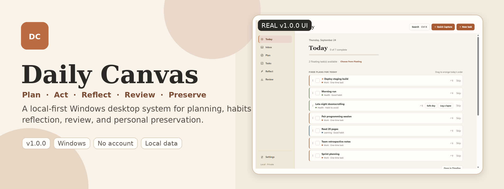
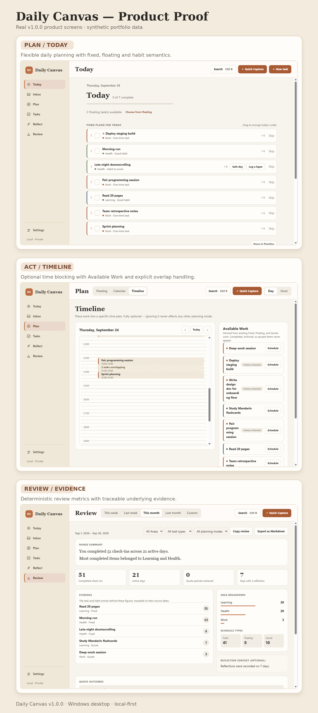
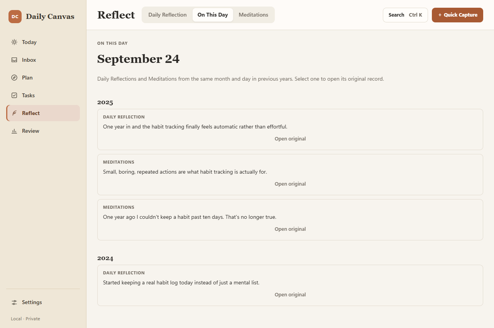
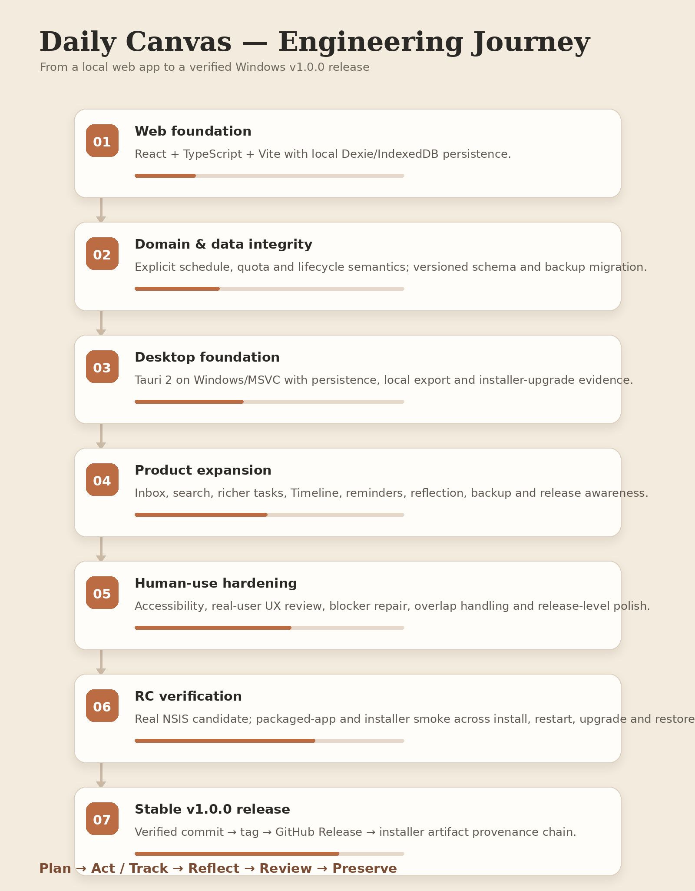
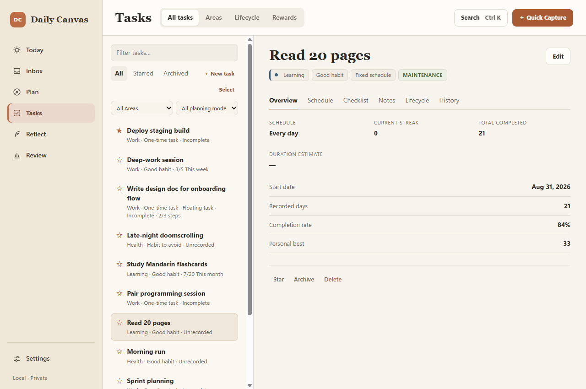

# Daily Canvas



**Daily Canvas 是一套无需账号、Local-First 的 Windows 桌面个人系统，用于计划、习惯、反思、回顾与长期保存。**

它服务于这样一种使用方式：你希望生活有结构，但又不想把所有事情都塞进僵硬的项目管理系统。Daily Canvas 把“我计划做什么”“我实际做了什么”“我从中感受到什么”“哪些东西值得长期保存”连接在同一套历史语义中，同时把核心数据留在自己的设备上。

**Windows · Local-First · React + TypeScript · Tauri 2 · v1.0.0**

[下载 v1.0.0](https://github.com/Peter-S-Shi/Daily-Canvas/releases/tag/v1.0.0) · [架构文档](ARCHITECTURE.md) · [发布与验证记录](PROJECT_STATUS.md) · [English](README.md)

---

## 真实产品界面

下面的界面均来自已经发布的 **v1.0.0 Windows 正式版本**，使用的是专门为 Portfolio 构造的合成数据。



Daily Canvas 并不把自己定位成“又一个 Todo App”。它把日常执行与长期证据连接起来，而不是把任务、习惯、反思和回顾拆成彼此孤立的工具。

---

## 为什么是 Daily Canvas

| 灵活，而不是强迫统一 | 历史必须诚实 | 数据属于用户 |
| --- | --- | --- |
| Fixed Schedule、Floating Task、Quota Goal、Inbox 与可选 Timeline 可以同时存在。并不是每件事都必须被塞进一个具体钟点。 | Missing 不会被偷偷算作成功。Replan 可以把未完成工作向前移动，但不会改写过去；暂停、恢复、里程碑仍然保留在习惯历史里。 | 核心数据留在本机。Daily Canvas 不需要账号、云数据库、遥测系统，也不依赖远程 AI。 |

---

## 一套系统，五个相连的层次

### Plan

使用普通任务、正向习惯、回避型习惯、Fixed Schedule、Floating Task、周/月 Quota Goal、Inbox Capture，以及可选的 Time Blocking。

### Act / Track

完成 check-in，记录回避型习惯的 Safe/Lapse 结果，Replan 未完成工作，把任务放进 Time Block，并使用克制的本地提醒。

### Reflect

记录 Daily Reflection；可选使用轻量 Reflection Template；在任务完成后附加 Experience Log；记录情绪，但不把这些信息解释成诊断结论。

### Review

查看按周、月或自定义时间范围生成的确定性总结，并且能够追溯到底层真实 Task/Habit evidence。Review 只描述已经记录的事实，不推断性格、因果关系或心理状态。

### Preserve

保存 Meditations，通过 On This Day 重新看到往年的 Reflection / Meditation，本地导出，并通过版本化备份与自动轮换备份保存完整产品状态。

---

## 不只是今天的任务，也是长期记忆

Daily Canvas 的设计强调时间连续性。**On This Day** 会重新呈现往年同月同日的 Daily Reflection 与 Meditation，让过去的记录重新变得有用，而不是永远沉在归档里。



---

## 工程深度

Daily Canvas 之所以适合作为 Portfolio 项目，并不是因为它“用了很多技术”，而是因为产品背后存在一系列明确的工程判断。

### Local-First 架构

核心个人数据留在本机；产品无需账号、云后端、遥测系统或远程 AI 服务也能完整使用。v1.0 唯一的网络例外，是用户主动触发的 GitHub Release metadata 查询，用于版本更新提醒。

### 明确的 Domain Semantics

Schedule、Quota、Habit Lifecycle、Pause/Resume、Review、Backup、Migration、Reminder 与桌面 Native concern 均位于可复用的 service/domain boundary，而不是把业务规则散落在 React component 里。

### 版本化的数据演进

Dexie schema 与 backup format 通过显式版本与 migration logic 演进。Restore 会先验证输入数据，并在破坏性替换之前创建 safety backup；来自未来的未知备份格式会安全失败。

### Risk-Scaled Verification

CI 深度随着修改风险变化：纯文档走低成本路径；普通应用代码执行 typecheck/tests/build；migration 与 backup 修改增加针对性 regression；桌面或 packaging 修改则增加 Windows/MSVC build、packaged-app smoke 与 installer/upgrade verification。

### 桌面发布纪律

v1.0.0 通过真实 Windows NSIS candidate、clean install / restart、upgrade、uninstall/reinstall、backup/restore 验证，以及最终的 provenance chain 完成发布：accepted commit、tag、GitHub Release 与分发 installer artifact 保持可追踪的一致关系。

完整验证记录见 [PROJECT_STATUS.md](PROJECT_STATUS.md)。

---

## Engineering Journey

Daily Canvas 经历的是一条完整的软件产品生命周期，而不是一次性的“把功能写出来”。



详细 milestone 历史继续保存在 [ROADMAP.md](ROADMAP.md) 与 [DEVLOG.md](DEVLOG.md) 中；这里刻意不让开发流水账占据产品首页。

---

## Task 与 Habit 的长期状态深度

产品模型不会把长期任务和习惯压缩成一个简单的 “done” 标记。Recurrence、Lifecycle State、Completion History、Personal Best、Streak、Checklist、Notes 与 Schedule semantics 都保持可检查、可追踪。



---

## Local-First 与数据所有权

```text
Tasks · habits · reflections · meditations · settings · backups
                              │
                              ▼
                           本机

v1.0 唯一网络例外：
用户主动触发的 GitHub Release metadata 更新检查
```

Daily Canvas **不会**上传你的任务、习惯、反思、Meditation、使用分析或其它个人内容。Update Awareness 只会在打开 **Settings → About & Updates** 或主动点击检查更新时读取 stable release metadata。

Manual JSON export/import 与 automatic rotating local backup 同时保留。

---

## 试用 Daily Canvas

### Windows v1.0.0

1. 打开 [v1.0.0 GitHub Release](https://github.com/Peter-S-Shi/Daily-Canvas/releases/tag/v1.0.0)。
2. 下载 `Daily.Canvas_1.0.0_x64-setup.exe`。
3. 运行 per-user installer。
4. 从 Windows Start Menu 启动 **Daily Canvas**。

正常的 per-user 安装不需要管理员权限。

### 当前限制

- **仅支持 Windows。** v1.0 已在项目 CI 使用的 Windows/MSVC 路径上验证；其它 Windows 版本和非英文 Windows locale 尚未逐一认证。
- **Installer 尚未 code-sign。** Windows SmartScreen 可能显示 “unrecognized publisher”。
- **目前只有 per-user installer。** v1.0 没有 MSI 或 machine-wide installation。
- **卸载默认保留本地数据。** 当前 NSIS uninstall 会移除应用，但不会在卸载流程中提供“同时删除我的数据”的选项。
- **不会自动自更新。** Daily Canvas 可以告诉你有新的 GitHub Release，但绝不会静默下载或安装。

---

## 有意识的产品边界

Daily Canvas 刻意**不**试图成为：

- account-driven SaaS；
- 团队协作平台；
- 无限递归的项目管理树；
- 社交化 habit leaderboard；
- 强制 cloud sync 的应用；
- 依赖远程 AI 的产品；
- 临床心理健康工具或 AI therapist；
- 静默自动更新器。

核心层级保持刻意简洁：

```text
Area
  └── Task
       └── optional one-level Checklist items
```

如果一个 Checklist item 需要自己的 Schedule、Lifecycle、Quota、Reward 或 History，它应该升级成一个真正的 Task，而不是继续增加递归层级。

---

## 技术栈

**Frontend:** React 19 · TypeScript · Vite  
**Desktop:** Tauri 2 · Rust · Windows/MSVC · NSIS  
**Local data:** Dexie · IndexedDB  
**Testing:** Vitest · packaged-app smoke · installer/upgrade smoke  
**Delivery:** GitHub Actions · GitHub Releases

这些技术选择服务于产品架构；它们本身并不是产品故事。

---

## 从源码运行

要求：

- Node.js 20.19+
- pnpm
- Tauri 桌面开发所需的 Rust toolchain
- Windows/MSVC（权威桌面构建路径）

```bash
pnpm install
pnpm dev
```

质量检查：

```bash
pnpm typecheck
pnpm test
pnpm build
```

桌面：

```bash
pnpm desktop:dev
pnpm desktop:build
pnpm desktop:bundle
```

在 Windows 上可以使用 `OPEN_DAILY_CANVAS_DEV.cmd` 来准备并解释 Visual Studio Build Tools / MSVC 环境要求。

---

## 深入技术文档

- [ARCHITECTURE.md](ARCHITECTURE.md) — 架构、持久化、Domain boundary、Desktop/Native boundary、测试与 CI 模型
- [PROJECT_STATUS.md](PROJECT_STATUS.md) — 权威发布状态与验证证据
- [ROADMAP.md](ROADMAP.md) — 产品与工程 milestone 历史
- [DEVLOG.md](DEVLOG.md) — 实现历史与 hardening 记录
- [`desktop-verify/`](desktop-verify/) — packaged desktop verification infrastructure 与 evidence
- [v1.0.0 Release](https://github.com/Peter-S-Shi/Daily-Canvas/releases/tag/v1.0.0) — stable installer 与 release notes

---

## License

当前仓库尚未声明开源许可证。在许可证发生变化之前，源码虽然公开可见，但不应被默认理解为已经授权复用。
